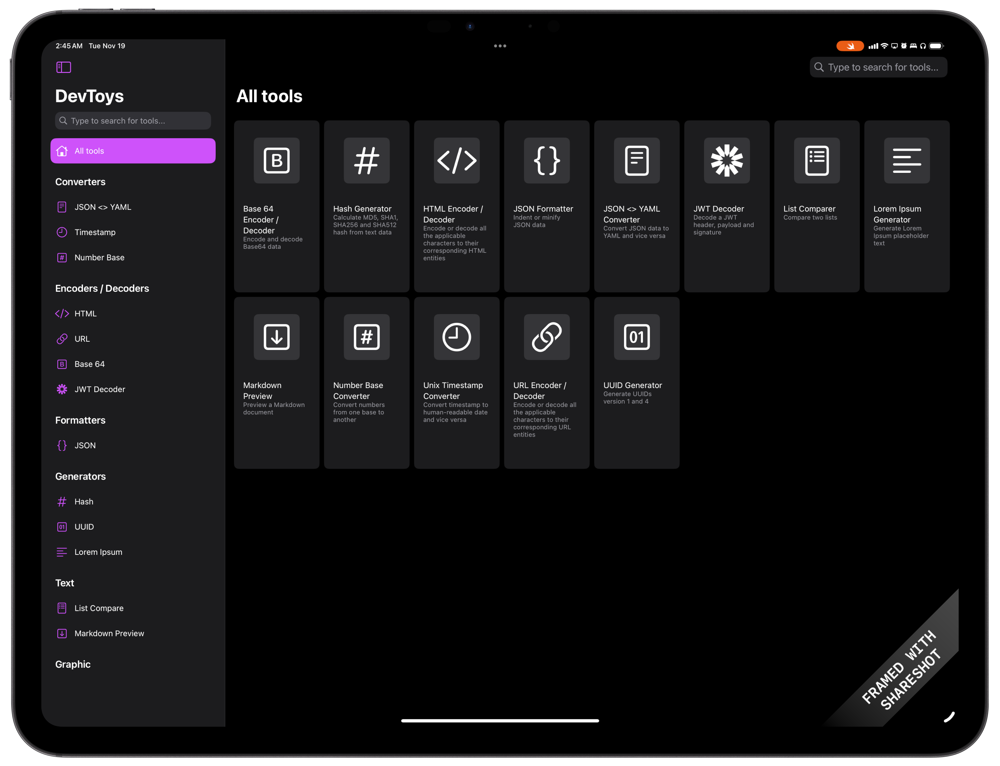

# DevToys for iPad

This app is a SwiftUI reimplementation of [DevToys](https://devtoys.app), a Swiss Army Knife for developers, for iPadOS.

## Features

- Converters
  - [x] JSON <> YAML
    - Partial support
  - [x] Number Base
  - [x] Unix Timestamp
- Encoders / Decoders
  - [x] HTML
  - [x] URL
  - [x] Base64
  - [ ] GZip
  - [x] JWT Decoder
- Formatters
  - [x] JSON
  - [ ] SQL
  - [ ] XML
- Generators
  - [x] Hash (MD5, SHA1, SHA256, SHA512)
  - [x] UUID (v1, v4)
  - [x] Lorem Ipsum
  - [ ] Checksum
- Text
  - [ ] Inspector & Case Converter
  - [ ] Regex Tester
  - [ ] Text Comparer
  - [x] Markdown Preview
- Graphic
  - [ ] Color Blindness Simulator
  - [ ] PNG / JPEG Compressor
  - [ ] Image Converter

## Target platforms

- iPadOS 17.2 or later
- iOS 17.2 or later
  
## Build requirements

- Swift Playgrounds 4.5 or later (iPadOS 17.2 or later)
- Swift Playgrounds 4.5 or later (macOS 13.0 or later)
- Xcode 15.3 or later (macOS 14.0 or later)

## Get Started

1. Clone this repository
    - To clone, I recommend using [Working Copy](https://workingcopyapp.com) or [a-Shell](https://holzschu.github.io/a-Shell_iOS/) (`lg2` command).
1. Open DevToys.swiftpm with Swift Playgrounds
1. Run
